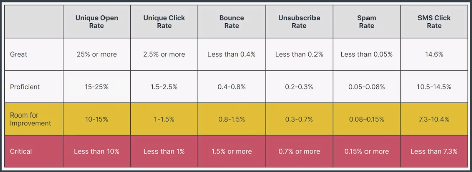
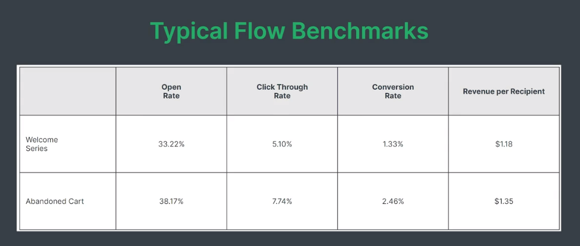

# Klaviyo

Klaviyo CEO and Founder Andrew Bialecki says that Klaviyo is more than just an email service provider, and Klaviyo is built to empower creators with the help of data science and intuitive software. 

# Klaviyo Product Certification

# Metrics for Good Deliverability

# Deliverability and Sender Reputation

Let's look at some best practices to keep your deliverability high and maintain a good sender reputation. Remember to regularly clean your list, especially if you use single-opt in when collecting consent, to ensure you remove unengaged customers and any broken or defunct emails. When open rates go low or unsubscribe rates rise, evaluate what you're sending and who you are sending to, and try to target your messages more specifically. 

# Campaign

Campaign =  Bread and Butter of Marketing

# Key Metrics for Success

- CAC - Customer Acquisition Costs
- AOV - Average Order Value
- NPS - Net Promoter Score
- CLV - Customer Lifetime Value
- 
- Open Rates
- Click Rates
- Unsubscribe Rates
- Spam Rates
- 
- Form Submit Rate